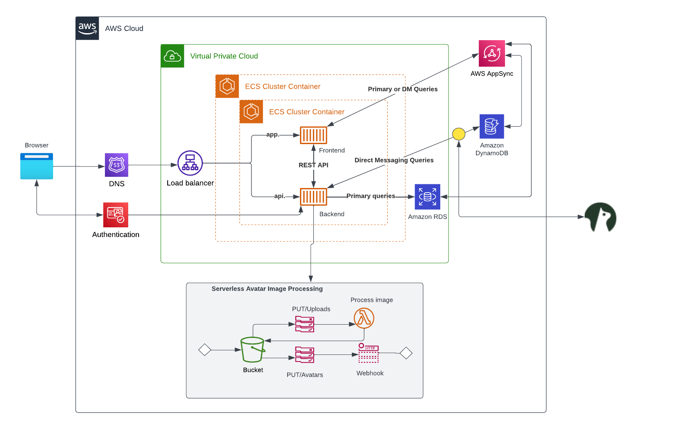
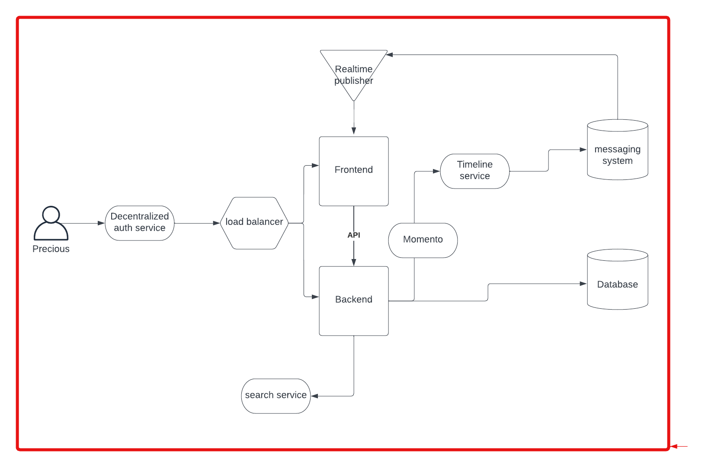
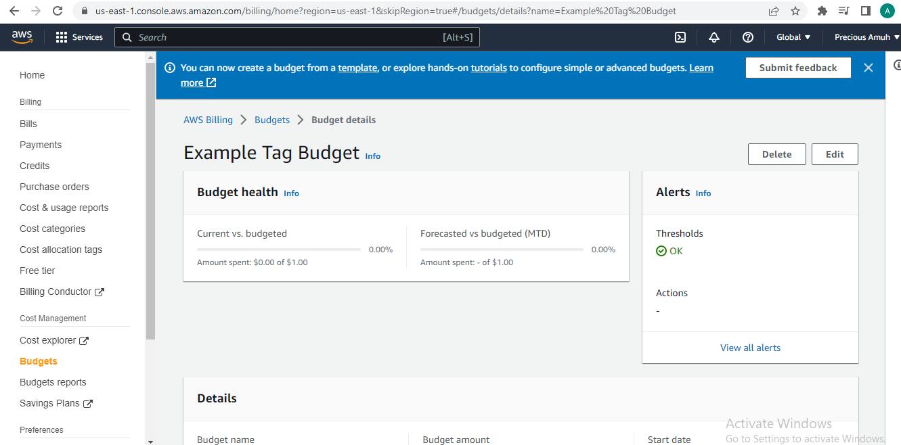

# Week 0 — Billing and Architecture

### Required Homework 

I recreated the logical Architectural diagram for Cruddur in Lucid charts. Here's the [link](https://lucid.app/lucidchart/ea9f31f0-a440-4ab4-a9f7-a6eb47525da4/edit?viewport_loc=-336%2C410%2C2220%2C1038%2C0_0&invitationId=inv_5b7e3d7d-5a89-4f88-b64b-93dd83c72536)

I also recreated the conceptual diagram done in class in Lucid charts. Here's the [link](https://lucid.app/lucidchart/a7c681f7-ad72-4fec-a378-216ce65fcaf6/edit?viewport_loc=-344%2C-172%2C2220%2C1038%2C0_0&invitationId=inv_7153b786-cd40-4b25-8146-a4415b657c90)

### Creating Budget 
I created a $1 budget using the AWS CLI

